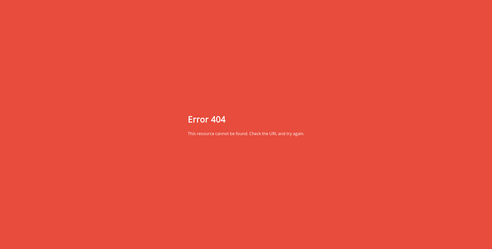
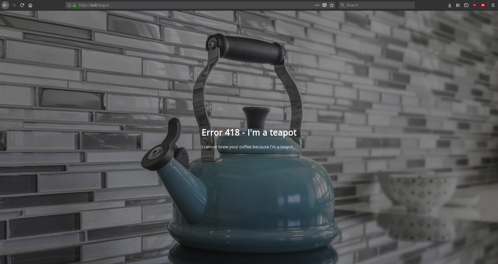

# Error Pages
Add error pages to your virtual machines !

## Installation
Go to the `html` file and run the following command
```bash
mkdir /errors
```
This folder will contain the HTML files of our errors.

Now, still in the `html` folder, run the following commands
```bash
mkdir /_errors
```
This will allow us to access the CSS of HTML files


## Screenshots
### 502 Error Page


### 404 Error Page


### 418 - I'm a Teapot

